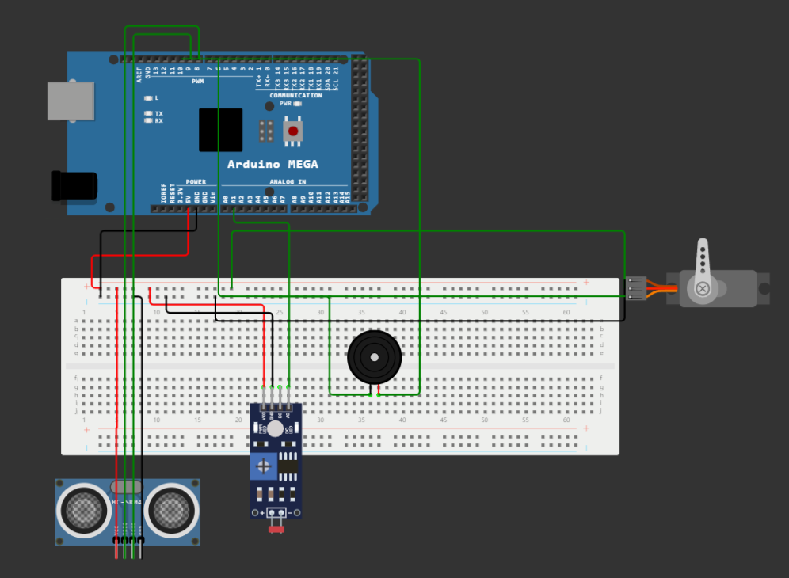
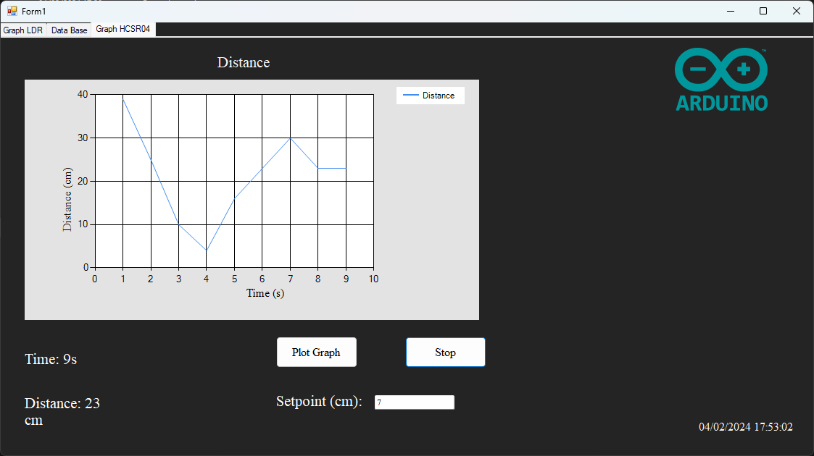
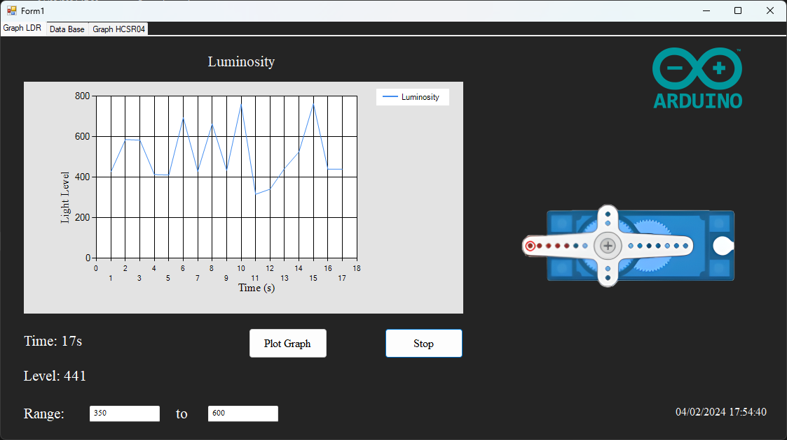
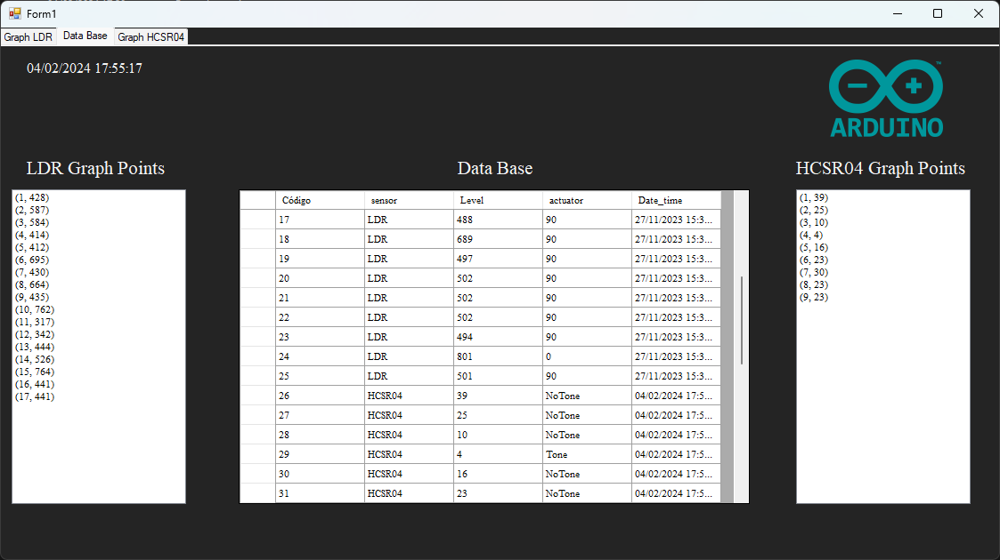

# Sistema Supervisório com Arduino e C#

Este simples sistema supervisório foi construído como projeto final da disciplina de Programação de Computadores II do 2° semestre de Engenharia de Controle e Automação. O sistema monitora distância (através do sensor ultrassônico HCSR04) e o nível de luminosidade (sensor LDR). Através do programa escrito em C#, é possível definir um limiar para a distância e o nível de luminosidade, e, caso esse limiar seja atingido, um atuador será acionado, podendo ser um buzzer ou um servo motor. O código em C# também plota o gráfico dos níveis de luminosidade e distância ao decorrer do tempo, e também insere esses dados em um banco de dados Access, com a data e hora do recebimento dos dados.

## Lista de componentes utilizados:

* 1x Arduino Mega 2560
* 1x Sensor Ultrassônico HCSR04
* 1x Módulo Sensor LDR
* 1x Buzzer
* 1x Micro Servo-Motor SG90

## Esquemático do Circuito:

## Interface da aplicação C#:

 
